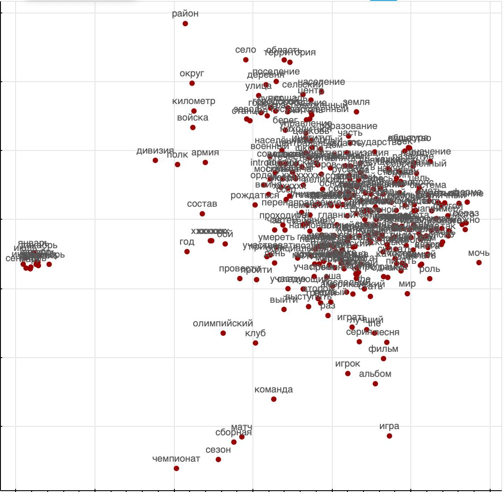
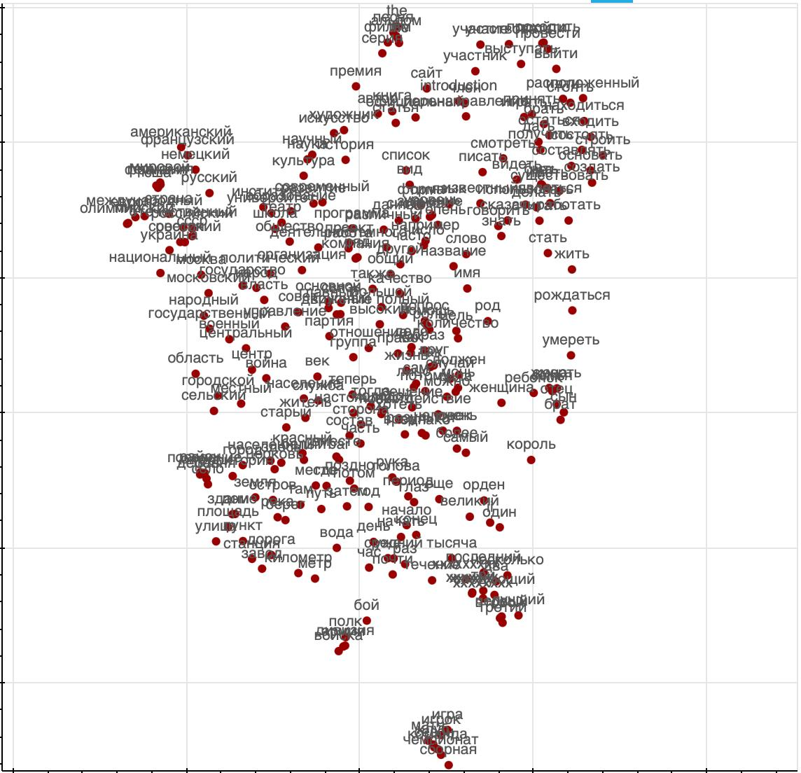

# Сравнение методов визуализации векторов слов

### **PCA (Линейное проецирование)**
Алгоритм PCA ищет ортогональные оси максимальной дисперсии данных через спектральное разложение ковариационной матрицы. Строгое свойство: это оптимальная **линейная** проекция по критерию минимальной ошибки реконструкции в смысле L2-нормы. Результат детерминирован и интерпретируем — оси соответствуют главным направлениям вариации. Для векторов слов PCA сохранит глобальные евклидовы отношения, но исказит любые нелинейные семантические кластеры, превратив их в эллипсоидальные облака, вытянутые вдоль главных компонент.

### **t-SNE (Локальная оптимизация соседств)**
Алгоритм t-SNE итеративно минимизирует расхождение между распределениями расстояний в исходном и целевом пространствах, используя гауссовы распределения для исходных сходств и тяжёлые хвосты распределения Стьюдента для низкоразмерных. Критическое формальное свойство: алгоритм **жертвует глобальной структурой** для точного сохранения локальных расстояний между ближайшими соседями. Это приводит к визуальному эффекту «сжатия» локальных кластеров и искусственного увеличения межкластерных промежутков. Для векторов слов t-SNE создаст изолированные семантические острова, но взаимное расположение этих островов будет неинформативно.

### **UMAP (Топологическое приближение многообразия)**
Алгоритм UMAP сначала строит взвешенный граф k-ближайших соседей, представляющий топологическую структуру данных, а затем оптимизирует низкоразмерное представление для сохранения этого графа. Ключевое отличие от t-SNE в формальной постановке: UMAP **не нормирует сходства на глобальную сумму**, что позволяет одновременно сохранять и локальные, и глобальные топологические свойства исходного многообразия. Практическое следствие: UMAP сохраняет не только плотность локальных кластеров, но и приближённые отношения между ними — например, иерархическую вложенность тематических групп в векторном пространстве слов, давая более целостную структурную карту.

