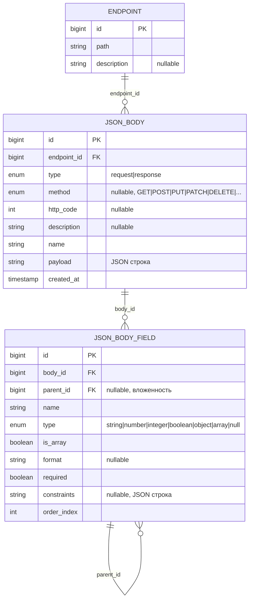

```mermaid
erDiagram
    JSON_BODY ||--o{ JSON_BODY_FIELD : "body_id"
    JSON_BODY_FIELD ||--o{ JSON_BODY_FIELD : "parent_id"

    ENDPOINT ||--o{ JSON_BODY : "endpoint_id"

    JSON_BODY {
        bigint id PK
        bigint endpoint_id FK
        enum type "request|response"
        enum method "nullable, GET|POST|PUT|PATCH|DELETE|..."
        int http_code "nullable"
        string description "nullable"
        string name
        string payload "JSON строка"
        timestamp created_at
    }

    JSON_BODY_FIELD {
        bigint id PK
        bigint body_id FK
        bigint parent_id FK "nullable, вложенность"
        string name
        enum type "string|number|integer|boolean|object|array|null"
        boolean is_array
        string format "nullable"
        boolean required
        string constraints "nullable, JSON строка"
        int order_index
    }

    ENDPOINT {
        bigint id PK
        string path
        string description "nullable"
    }
```