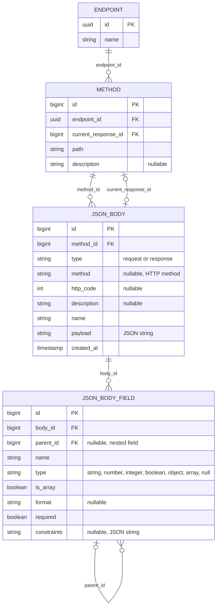

# БД

## Схема

```mermaid

erDiagram
    JSON_BODY {
        bigint id PK
        bigint method_id FK
        string type "request or response"
        string method "nullable, HTTP method"
        int http_code "nullable"
        string description "nullable"
        string name
        string payload "JSON string"
        timestamp created_at
    }

    JSON_BODY_FIELD {
        bigint id PK
        bigint body_id FK
        bigint parent_id FK "nullable, nested field"
        string name
        string type "string, number, integer, boolean, object, array, null"
        boolean is_array
        string format "nullable"
        boolean required
        string constraints "nullable, JSON string"
    }

    METHOD {
        bigint id PK
        uuid endpoint_id FK
        bigint current_response_id FK
        string path
        string description "nullable"
    }

    ENDPOINT {
        uuid id PK
        string name
    }

    METHOD ||--o{ JSON_BODY : "method_id"
    JSON_BODY ||--o{ JSON_BODY_FIELD : "body_id"
    JSON_BODY_FIELD o|--o{ JSON_BODY_FIELD : "parent_id"
    ENDPOINT ||--o{ METHOD : "endpoint_id"
    METHOD o|--o| JSON_BODY : "current_response_id"

```