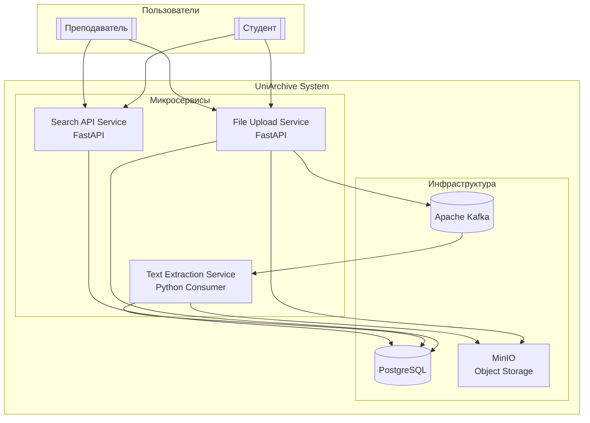

# Архитектура UniArchive

## Архитектурный стиль

Система построена на основе **микросервисной архитектуры** с **асинхронным взаимодействием** через брокер сообщений Apache Kafka. Каждый сервис автономен, имеет собственную базу данных (или схему) и выполняет одну бизнес-функцию.

## Диаграмма контейнеров C4 (Level 2)



## Микросервисы

### 1. File Upload Service (MS-1)
**Назначение:** Прием файлов от пользователей и сохранение метаданных.


**Основные функции:**
- Валидация входящих файлов (размер, тип)
- Сохранение файлов в MinIO (S3-совместимое хранилище)
- Запись метаданных в PostgreSQL
- Отправка события `FileUploaded` в Kafka

**API эндпоинты:**
- `POST /api/v1/upload` - загрузка файла с метаданными
- `GET /api/v1/upload/{id}/status` - статус обработки файла

### 2. Text Extraction Service (MS-2)
**Назначение:** Асинхронная обработка загруженных файлов.

**Технологии:** Kafka

**Основные функции:**
- Подписка на топик Kafka `file.uploaded`
- Извлечение текста из поддерживаемых форматов (PDF, DOCX, TXT)
- Обновление статуса обработки в базе данных
- Отправка события `TextExtracted` в Kafka

**Поддерживаемые форматы:**
- PDF 
- DOCX 
- TXT, MD 

### 3. Search API Service (MS-3)
**Назначение:** Поиск и фильтрация файлов.

**Технологии:** PostgreSQL

**Основные функции:**
- Фильтрация файлов по предмету (subject)
- Сортировка по дате загрузки
- Пагинация результатов
- Полнотекстовый поиск (при наличии extracted_text)

**API эндпоинты:**
- `GET /api/v1/files` - поиск с фильтрацией (`?subject=math&sort=-date`)
- `GET /api/v1/files/{id}` - получение информации о файле
- `GET /api/v1/files/{id}/download` - скачивание файла

## Инфраструктурные компоненты

### 1. Apache Kafka
**Роль:** Брокер сообщений для асинхронной коммуникации.

**Топики:**
- `file.uploaded` - событие загрузки нового файла
  ```json
  {
    "event_id": "uuid",
    "event_type": "FileUploaded",
    "file_id": "uuid",
    "storage_path": "s3://bucket/path/file.pdf",
    "original_name": "lecture.pdf",
    "mime_type": "application/pdf",
    "timestamp": "2024-01-15T10:30:00Z"
  }
  ```
- `text.extracted` - событие завершения обработки текста
  ```json
  {
    "event_id": "uuid",
    "event_type": "TextExtracted",
    "file_id": "uuid",
    "success": true,
    "text_length": 1500,
    "processing_time_ms": 1200,
    "timestamp": "2024-01-15T10:31:12Z"
  }
  ```

### 2. PostgreSQL
**Роль:** Хранение метаданных файлов и извлеченного текста.

**Схема:** Отдельная схема или база для каждого сервиса (рекомендуется)
- `upload_service` - таблицы для MS-1
- `search_service` - таблицы для MS-3 (может использовать те же таблицы через синонимы)

### 3. MinIO
**Роль:** Объектное хранилище для файлов.

**Структура:**
```
uniarchive-bucket/
├── files/
│   ├── 2024/
│   │   ├── 01/
│   │   │   ├── {uuid}.pdf
│   │   │   └── {uuid}.docx
│   │   └── 02/
└── previews/ (для будущих превью)
```

## Масштабирование

### Вертикальное масштабирование:
- **MS-1:** Увеличение количества воркеров FastAPI (gunicorn/uvicorn)
- **MS-2:** Увеличение количества consumer-групп в Kafka
- **MS-3:** Добавление реплик для чтения

### Горизонтальное масштабирование:
- Разделение топиков Kafka по партициям
- Шардирование PostgreSQL по предметам (subject)
- Распределение файлов по нескольким бакетам MinIO

### Метрики:
- **MS-1:** Количество загруженных файлов, средний размер, ошибки загрузки
- **MS-2:** Время обработки файлов, успешность извлечения текста, очередь обработки
- **MS-3:** Время ответа API, популярные предметы для поиска

---

