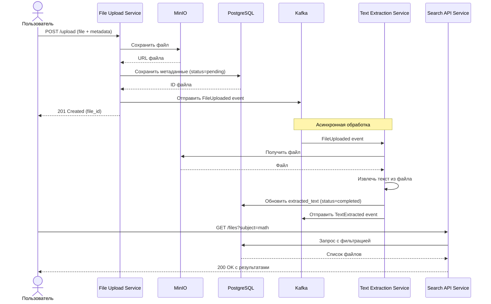

# Основная информация

```mermaid
sequenceDiagram
    actor User as Пользователь
    participant MS1 as File Upload Service
    participant MINIO as MinIO
    participant PG as PostgreSQL
    participant K as Kafka
    participant MS2 as Text Extraction Service
    participant MS3 as Search API Service
    
    User->>MS1: POST /upload (file + metadata)
    MS1->>MINIO: Сохранить файл
    MINIO-->>MS1: URL файла
    MS1->>PG: Сохранить метаданные (status=pending)
    PG-->>MS1: ID файла
    MS1->>K: Отправить FileUploaded event
    MS1-->>User: 201 Created (file_id)
    
    Note over K,MS2: Асинхронная обработка
    K->>MS2: FileUploaded event
    MS2->>MINIO: Получить файл
    MINIO-->>MS2: Файл
    MS2->>MS2: Извлечь текст из файла
    MS2->>PG: Обновить extracted_text (status=completed)
    MS2->>K: Отправить TextExtracted event
    
    User->>MS3: GET /files?subject=math
    MS3->>PG: Запрос с фильтрацией
    PG-->>MS3: Список файлов
    MS3-->>User: 200 OK с результатами
```