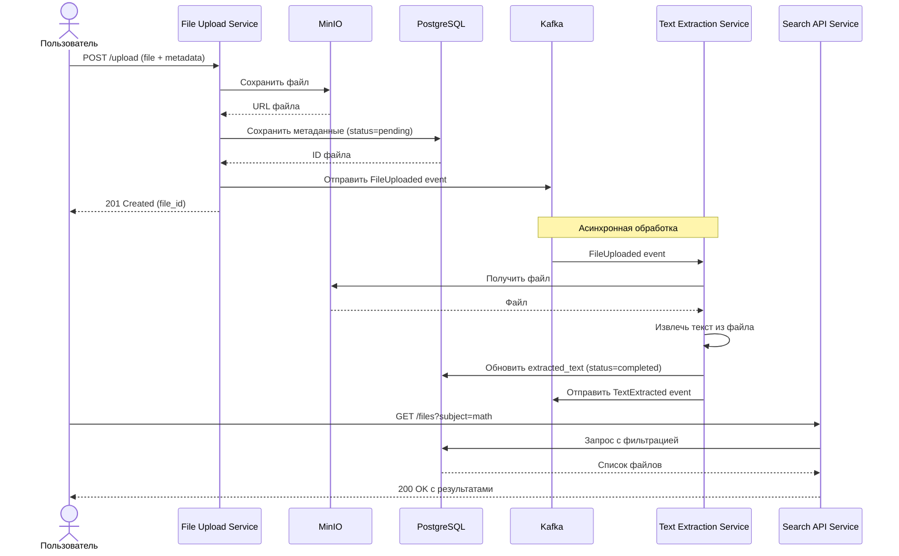
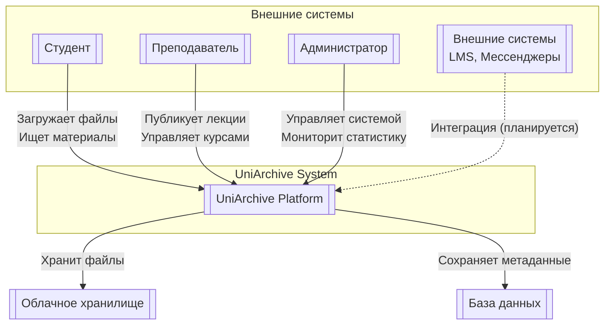

# Основная информация

## Бизнес-контекст

**Проблема:** В процессе обучения студенты и преподаватели сталкиваются с проблемой потери и трудности поиска учебных материалов. Файлы хранятся в различных мессенджерах (Telegram, Discord), почте, облачных дисках, что приводит к:
- Дублированию материалов
- Сложности поиска старых файлов
- Отсутствию структуры и метаданных
- Потере контекста обсуждения файлов

**Решение:** UniArchive — централизованная платформа для хранения, обработки и поиска учебных материалов с интеллектуальной обработкой и структурированной организацией.

## Бизнес-требования

### 1. Функциональные требования
**BR-01:** Загрузка учебных материалов
- Пользователи могут загружать файлы различных форматов (PDF, DOCX, PPTX, TXT)
- Обязательное указание метаданных: название, учебный предмет
- Максимальный размер файла: 100 МБ

**BR-02:** Автоматическая обработка файлов
- Автоматическое извлечение текста из загруженных файлов
- Определение MIME-типа и размера файла
- Фоновая обработка без блокировки пользователя

**BR-03:** Поиск и фильтрация
- Фильтрация файлов по учебному предмету (subject)
- Сортировка по дате загрузки (новые/старые)
- Просмотр списка файлов с пагинацией

**BR-04:** Управление доступом
- Три роли пользователей: Студент, Преподаватель, Администратор
- Различные права доступа для каждой роли
- Аудит операций с файлами

### 2. Нефункциональные требования
**BR-05:** Производительность
- Время отклика API: < 200 мс для 95% запросов
- Поддержка одновременной загрузки от 100 пользователей
- Обработка до 1000 файлов в час

**BR-06:** Надежность
- Доступность системы: 99.5%
- Сохранность загруженных файлов: 100%
- Резервное копирование данных каждые 24 часа

**BR-07:** Масштабируемость
- Горизонтальное масштабирование микросервисов
- Поддержка увеличения нагрузки в 10 раз
- Возможность добавления новых обработчиков файлов

**BR-08:** Безопасность
- Защита от загрузки вредоносных файлов
- Шифрование данных при хранении
- Аутентификация и авторизация пользователей

## Целевая аудитория

### 1. Студенты
- **Потребности:** Быстрый поиск лекций, лабораторных работ, методичек
- **Использование:** Загрузка материалов, поиск по предметам, скачивание файлов
- **Бенефиты:** Экономия времени, структурирование материалов, доступность

### 2. Преподаватели
- **Потребности:** Распространение учебных материалов, отслеживание доступности
- **Использование:** Загрузка лекций, организация материалов по предметам
- **Бенефиты:** Централизованное хранилище, контроль версий, статистика

### 3. Администраторы
- **Потребности:** Управление системой, мониторинг, техническая поддержка
- **Использование:** Управление пользователями, просмотр логов, резервное копирование
- **Бенефиты:** Контроль за использованием, аналитика, безопасность

## Сценарии использования

### Сценарий 1: Загрузка лекции (Преподаватель)
1. Преподаватель заходит в систему
2. Выбирает предмет "Математический анализ"
3. Загружает файл "Лекция 1. Пределы.pdf"
4. Система принимает файл и начинает фоновую обработку
5. Преподаватель получает подтверждение загрузки

### Сценарий 2: Поиск лабораторной работы (Студент)
1. Студент заходит в систему
2. Выбирает фильтр "Программирование"
3. Сортирует по дате (новые сверху)
4. Находит нужную лабораторную работу
5. Скачивает файл на устройство

### Сценарий 3: Мониторинг системы (Администратор)
1. Администратор заходит в панель управления
2. Просматривает статистику загрузок
3. Проверяет очередь обработки файлов
4. Экспортирует отчет за месяц
5. Выполняет резервное копирование

## Диаграмма последовательности (основной сценарий)

## Диаграмма контекста C4 (Level 1)

## Технологическое обоснование

### Почему микросервисы?
1. **Независимость разработки:** Команды могут работать над разными сервисами параллельно
2. **Гибкость технологий:** Возможность использовать разные технологии для разных задач
3. **Масштабируемость:** Каждый сервис масштабируется независимо по мере нагрузки
4. **Отказоустойчивость:** Падение одного сервиса не приводит к падению всей системы

### Почему Kafka для асинхронности?
1. **Гарантированная доставка:** Сообщения не теряются при сбоях
2. **Буферизация нагрузки:** Позволяет обрабатывать пиковые нагрузки
3. **Декомпозиция времени:** Сервисы работают в своем темпе
4. **Простота интеграции:** Легко добавлять новые потребители событий

