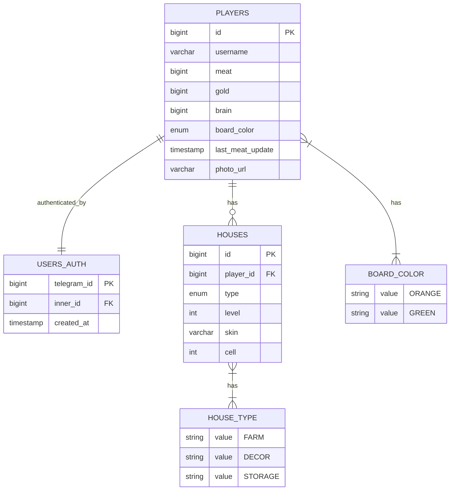

# Zombie-farm Backend

## НФТ

### 1. Требования к доступности (Availability)
**NF-1.1:** Система должна обеспечивать доступность не менее 99% в рабочее время (Пн-Пт, 9:00-18:00 по московскому времени).
**NF-1.2:** Допустимый простой при деплое обновлений — не более 5 минут.
**NF-1.3:** Время отклика системы при 95-м процентиле должно составлять не более 3 секунд для основных операций.

### 2. Требования к производительности (Performance)
**NF-2.1:** Система должна поддерживать до 50 одновременных пользователей в пиковые часы.
**NF-2.2:** Время загрузки страниц интерфейса должно быть не более 2 секунд при скорости соединения 10 Мбит/с.
**NF-2.3:** API-эндпоинты должны обрабатывать до 20 запросов в секунду на один инстанс.

### 3. Требования к безопасности (Security)
**NF-3.1:** Все передаваемые данные должны быть защищены с использованием TLS версии 1.2 и выше.
**NF-3.2:** Cookies должны устанавливаться с флагами Secure и SameSite=Lax.
**NF-3.3:** CSRF-токены должны генерироваться для всех операций изменения данных.
**NF-3.4:** Сессии пользователей должны быть защищены от перехвата через использование защищенных cookies.
**NF-3.5:** Система должна обеспечивать аутентификацию и авторизацию пользователей.

### 4. Требования к надежности (Reliability)
**NF-4.1:** Система должна обеспечивать сохранность данных PostgreSQL при штатной работе.
**NF-4.2:** Потеря данных Redis является допустимой (данные в Redis считаются временными).
**NF-4.3:** Среднее время наработки на отказ (MTBF) должно составлять не менее 720 часов.

### 5. Требования к поддерживаемости (Maintainability)
**NF-5.1:** Деплой обновлений должен осуществляться автоматически через GitHub Actions при изменениях в ветках main/master.
**NF-5.2:** Система должна поддерживать контейнеризацию через Docker.
**NF-5.3:** Логи приложения должны сохраняться в директории logs/ на сервере.
**NF-5.4:** Система должна поддерживать разделение на среды Dev и Prod.

### 6. Требования к масштабируемости (Scalability)
**NF-6.1:** Архитектура должна поддерживать горизонтальное масштабирование backend-сервиса при необходимости.
**NF-6.2:** Конфигурация VPS должна быть не ниже: 1 vCPU / 2 GB RAM / 40 GB Disk.

### 7. Требования к совместимости (Compatibility)
**NF-7.1:** Backend-сервис должен работать на Spring Boot (Java).
**NF-7.2:** Frontend-приложение должно быть реализовано на React (Node.js).
**NF-7.3:** Система должна поддерживать браузеры: Chrome 90+, Firefox 88+, Safari 14+.
**NF-7.4:** Операционная система сервера: Debian 11.

### 8. Требования к развертыванию (Deployment)
**NF-8.1:** Развертывание должно осуществляться на VPS в Москве.
**NF-8.2:** Домен системы: hzfarm.ru.
**NF-8.3:** Reverse-proxy должен обеспечивать маршрутизацию и TLS-терминацию через Traefik.
**NF-8.4:** Сертификаты TLS должны обслуживаться автоматически через Traefik.

### 9. Требования к восстановлению (Recovery)
**NF-9.1:** Восстановление после сбоя базы данных должно быть возможно из последнего состояния volume.
**NF-9.2:** Откат версий приложения должен осуществляться вручную в течение 30 минут.
**NF-9.3:** Время восстановления сервиса (RTO) после сбоя не должно превышать 60 минут.

### 10. Требования к мониторингу (Monitoring)
**NF-10.1:** Система должна сохранять логи приложения для последующего анализа.
**NF-10.2:** Доступ к базе данных для административных целей должен обеспечиваться через PGAdmin.

### 11. Требования к документации
**NF-11.1:** Документация по окружениям и процессу деплоя должна поддерживаться в актуальном состоянии.
**NF-11.2:** Процедура отката должна быть документирована.


## ФТ

### 1. Управление игроком (Player Management)

#### 1.1. Получение данных игрока
**FR-1.1:** Система должна предоставлять возможность получения полной информации о текущем игроке.
*Включает: идентификатор, имя пользователя, URL фото, количество ресурсов (мясо, золото, мозги), цвет игровой доски, список построенных домов.*

**FR-1.2:** Система должна обеспечивать загрузку игровой конфигурации для клиента.
*Включает: конфигурацию домов и общую игровую логику.*

### 2. Система ресурсов (Resource System)

#### 2.1. Управление ресурсами
**FR-2.1:** Система должна предоставлять возможность получения игроком дополнительного мяса.

**FR-2.2:** Система должна предоставлять механизм конвертации ресурсов:
- **FR-2.2.1:** Конвертация мяса в мозги с указанием количества для конвертации
- **FR-2.2.2:** Конвертация мозгов в золото с указанием количества для конвертации

#### 2.2. Валидация ресурсов
**FR-2.3:** Система должна проверять наличие достаточного количества ресурсов перед выполнением конвертации.

### 3. Система строительства и домов (Building System)

#### 3.1. Строительство домов
**FR-3.1:** Система должна предоставлять возможность строительства нового дома с указанием:
- Типа дома (ферма, декор, хранилище)
- Скина (внешнего вида)
- Номера ячейки на игровом поле

**FR-3.2:** Система должна валидировать доступность ячейки для строительства.

#### 3.2. Управление существующими домами
**FR-3.3:** Система должна предоставлять возможность улучшения уровня существующего дома.

**FR-3.4:** Система должна предоставлять возможность изменения внешнего вида (скина) существующего дома.

**FR-3.5:** Система должна предоставлять возможность перемещения дома на другую ячейку игрового поля.

**FR-3.6:** Система должна предоставлять возможность удаления дома с подтверждением успешного удаления.

#### 3.3. Просмотр домов
**FR-3.7:** Система должна предоставлять возможность получения информации о конкретном доме по его идентификатору.

**FR-3.8:** Система должна предоставлять возможность получения списка всех домов текущего игрока.

### 4. Игровая механика и баланс (Game Mechanics)

#### 4.1. Конфигурация игры
**FR-4.1:** Система должна предоставлять клиенту конфигурационные данные о:
- Характеристиках различных типов домов
- Игровых формулах и балансе

**FR-4.2:** Конфигурация должна включать параметры для:
- Стоимости строительства домов
- Доступных скинов для каждого типа дома
- Бонусов от домов разных уровней
- Коэффициентов конвертации ресурсов

### 5. Взаимодействие с игровым полем (Game Board Interaction)

#### 5.1. Расположение объектов
**FR-5.1:** Система должна поддерживать размещение домов на клеточном игровом поле с нумерацией ячеек.

**FR-5.2:** Система должна обеспечивать уникальность расположения домов (один дом на одну ячейку).

#### 5.2. Визуальные настройки
**FR-5.3:** Система должна предоставлять возможность выбора цвета игровой доски из доступных вариантов (оранжевый, зеленый).

### 6. Система идентификации и доступа (Identification System)

#### 6.1. Управление сессиями
**FR-6.1:** Система должна идентифицировать текущего игрока для всех операций с ресурсами и домами.

**FR-6.2:** Каждый дом должен быть привязан к идентификатору игрока-владельца.

### 7. Обратная связь и подтверждения (Feedback System)

#### 7.1. Подтверждение операций
**FR-7.1:** Система должна предоставлять подтверждение успешного удаления дома, включая:
- Флаг успешности операции
- Идентификатор удаленного дома

**FR-7.2:** Система должна возвращать обновленные данные игрока после операций изменения ресурсов.

**FR-7.3:** Система должна возвращать обновленные данные дома после операций модификации.

### 8. Типы домов и специализация (House Types Specialization)

#### 8.1. Фермы (FARM)
**FR-8.1:** Дома типа FARM должны участвовать в механизме генерации или управления ресурсами.

#### 8.2. Декорации (DECOR)
**FR-8.2:** Дома типа DECOR должны предоставлять визуальные улучшения или бонусы к эстетике.

#### 8.3. Хранилища (STORAGE)
**FR-8.3:** Дома типа STORAGE должны влиять на вместимость или эффективность хранения ресурсов.


## БД



## Интеграции
* Для интеграции в проекте использован graphql из-за своей гибкости
* Контракт

```
scalar DateTime
scalar Long
scalar JSON

type Mutation {
  buildHouse(input: BuildHouseInput!): House!
  updateHouseLevel(input: HouseIdInput!): House!
  updateHouseSkin(input: UpdateHouseSkinInput!): House!
  updateHouseLocation(input: UpdateHouseLocationInput!): House!
  removeHouse(input: HouseIdInput!): RemoveHousePayload!
  updatePlayerMeat: Player!

  convertMeatToBrain(input: ConvertMeatToBrainInput!): Player!
  convertBrainToGold(input: ConvertBrainToGoldInput!): Player!
}

type Query {
  getPlayer: Player!
  getHouse(houseId: ID!): House
  getPlayerHouses: [House!]!

  getHousesInfoCfg: JSON!
  getGameLogicCfg: JSON!
}

input BuildHouseInput {
  type: HouseType!
  skin: String!
  cell: Int!
}

input UpdateHouseSkinInput {
  houseId: ID!
  newSkin: String!
}

input UpdateHouseLocationInput {
  houseId: ID!
  newCell: Int!
}

input HouseIdInput {
  houseId: ID!
}

input ConvertMeatToBrainInput {
  meatToSpend: Long!
}

input ConvertBrainToGoldInput {
  brainToSpend: Long!
}

type RemoveHousePayload {
  success: Boolean!
  deletedHouseId: ID!
}

type Player {
  id: ID!
  username: String!
  photoUrl: String!
  meat: Long!
  gold: Long!
  brain: Long!
  boardColor: BoardColor!
  houses: [House!]!
}

type House {
  id: ID!
  playerId: Long!
  type: HouseType!
  level: Int!
  skin: String!
  cell: Int!
}

enum BoardColor {
  ORANGE
  GREEN
}

enum HouseType {
  FARM
  DECOR
  STORAGE
}
```

## Алгоритм пересчета мяса

### 1. Получение текущих данных игрока
```
1. Запросить из базы данных:
   - currentMeat: текущее количество мяса
   - lastCalculationTime: время последнего пересчёта
   - playerHouses: список домов игрока (типы и уровни)
```

### 2. Валидация данных
```
1. Если игрок не найден → возврат ошибки "Player not found"
2. Если lastCalculationTime равен null → установить = currentTimestamp
```

### 3. Расчёт промежутка времени
```
1. elapsedSeconds = разница в секундах между currentTimestamp и lastCalculationTime
2. Если elapsedSeconds ≤ 0 → возврат currentMeat без изменений
```

### 4. Определение скорости генерации мяса
```
1. Получить базовую скорость генерации из конфигурации (baseMeatPerSecond)
2. Получить бонусы от домов типа FARM:
   - Для каждого дома FARM определить множитель генерации на основе его уровня
   - Формула: bonusMultiplier = Σ(houseLevel * farmHouseBonusCoefficient)
3. Итоговая скорость генерации:
   meatPerSecond = baseMeatPerSecond * (1 + bonusMultiplier)
```

### 5. Расчёт сгенерированного мяса
```
1. generatedMeat = meatPerSecond * elapsedSeconds
2. Применить ограничения:
   - Если есть дом типа STORAGE → проверить максимальную вместимость
   - generatedMeat = min(generatedMeat, storageCapacity - currentMeat)
   - Если generatedMeat < 0 → generatedMeat = 0
```

### 6. Обновление данных
```
1. newMeatAmount = currentMeat + generatedMeat
2. Обновить в базе данных:
   - meat = newMeatAmount
   - last_calculation_time = currentTimestamp
```
