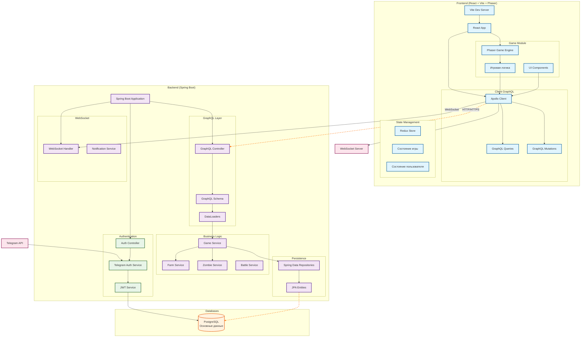

# Zombie-farm Backend

## Архитектура



## БД

```mermaid
erDiagram
    PLAYERS {
        bigserial id PK "PRIMARY KEY"
        varchar username "NOT NULL"
        bigint meat "DEFAULT 0"
        bigint gold "DEFAULT 0"
        bigint brain "DEFAULT 0"
        board_color board_color "NULL"
        timestamptz last_meat_update "DEFAULT CURRENT_TIMESTAMP"
        varchar photo_url "DEFAULT ''"
    }
    
    USERS_AUTH {
        bigint telegram_id PK "PRIMARY KEY"
        bigint inner_id FK "REFERENCES players(id)"
        timestamptz created_at "DEFAULT CURRENT_TIMESTAMP"
    }
    
    HOUSES {
        bigserial id PK "PRIMARY KEY"
        bigint player_id FK "REFERENCES players(id)"
        house_type type "NOT NULL"
        int level "DEFAULT 0"
        varchar skin 
        int cell "DEFAULT -1"
    }
    
    PLAYERS ||--o{ HOUSES : "has"
    PLAYERS ||--|| USERS_AUTH : "authenticated_by"
    
    PLAYERS {
        ENUM board_color VALUES: "ORANGE, GREEN"
    }
    
    HOUSES {
        ENUM house_type VALUES: "FARM, DECOR, STORAGE"
    }
    
    note right of PLAYERS
        Хранит основную информацию
        о игроке:
        - Ресурсы (meat, gold, brain)
        - Цвет доски
        - URL аватарки
        - Последнее обновление мяса
    end note
    
    note right of USERS_AUTH
        Связывает Telegram ID
        с внутренним ID игрока.
        Один Telegram ID = один игрок.
        Создается при первой аутентификации.
    end note
    
    note right of HOUSES
        Строения игрока:
        - Расположены в ячейках (cell)
        - Имеют уровень и скин
        - UNIQUE: один игрок - одна ячейка
        - cell = -1 означает "не размещено"
    end note
```

## Интеграции
* Для интеграции в проекте использован graphql из-за своей гибкости
* Контракт

```
scalar DateTime
scalar Long
scalar JSON

type Mutation {
  buildHouse(input: BuildHouseInput!): House!
  updateHouseLevel(input: HouseIdInput!): House!
  updateHouseSkin(input: UpdateHouseSkinInput!): House!
  updateHouseLocation(input: UpdateHouseLocationInput!): House!
  removeHouse(input: HouseIdInput!): RemoveHousePayload!
  updatePlayerMeat: Player!

  convertMeatToBrain(input: ConvertMeatToBrainInput!): Player!
  convertBrainToGold(input: ConvertBrainToGoldInput!): Player!
}

type Query {
  getPlayer: Player!
  getHouse(houseId: ID!): House
  getPlayerHouses: [House!]!

  getHousesInfoCfg: JSON!
  getGameLogicCfg: JSON!
}

input BuildHouseInput {
  type: HouseType!
  skin: String!
  cell: Int!
}

input UpdateHouseSkinInput {
  houseId: ID!
  newSkin: String!
}

input UpdateHouseLocationInput {
  houseId: ID!
  newCell: Int!
}

input HouseIdInput {
  houseId: ID!
}

input ConvertMeatToBrainInput {
  meatToSpend: Long!
}

input ConvertBrainToGoldInput {
  brainToSpend: Long!
}

type RemoveHousePayload {
  success: Boolean!
  deletedHouseId: ID!
}

type Player {
  id: ID!
  username: String!
  photoUrl: String!
  meat: Long!
  gold: Long!
  brain: Long!
  boardColor: BoardColor!
  houses: [House!]!
}

type House {
  id: ID!
  playerId: Long!
  type: HouseType!
  level: Int!
  skin: String!
  cell: Int!
}

enum BoardColor {
  ORANGE
  GREEN
}

enum HouseType {
  FARM
  DECOR
  STORAGE
}
```