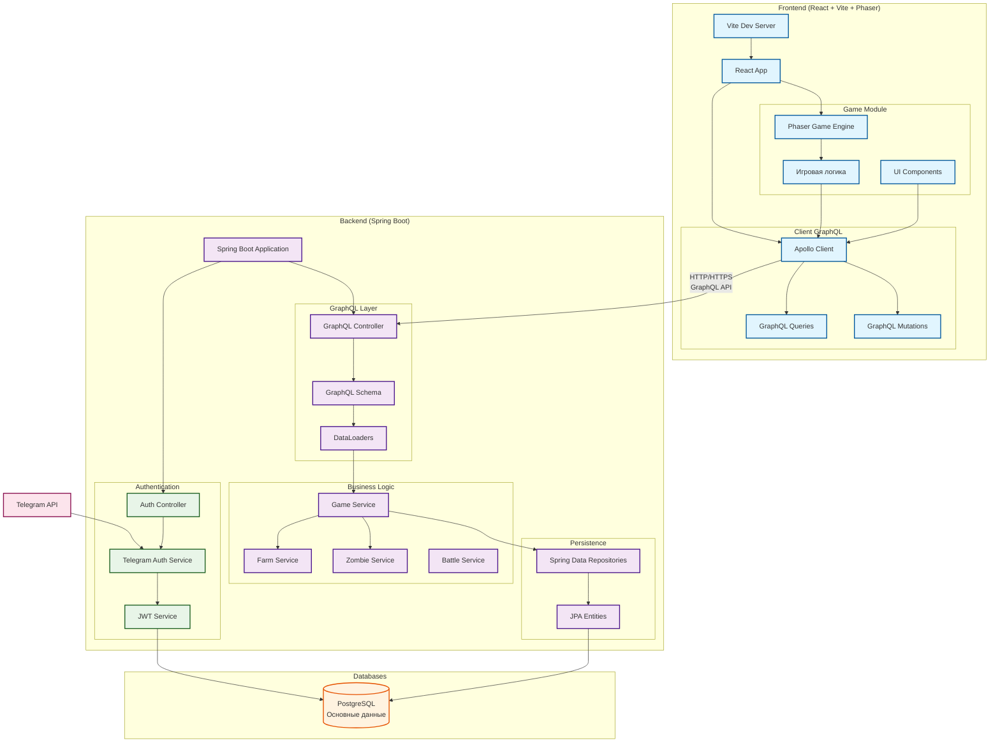

# Zombie-farm Common

## Архитектура

## Игровая механика

### Игровые параметры
- Игровое поле: сетка 4×4 клетки
- Основные ресурсы: мозги, деньги (бабки)
- Время последнего добавления ресурсов: отслеживается системой
- Количество зданий: учитывается для каждого типа

### Экономика и производство

#### Производственная цепочка
1. **Корова** → **Мясо**
    - Каждая корова производит 1 единицу мяса в секунду
    - Корова находится в загоне

2. **Мясо** → **Мозги** (через зомби)
    - Для получения 1 мозга требуется 5 единиц мяса
    - Зомби бродят по полю и выполняют конверсию

3. **Мозги** → **Монеты** (через магазин)
    - Курс обмена: 5 мозгов = 1 монета
    - Обмен происходит в меню магазина

#### Цель игры
Создание уникальной фермы через приобретение:
- Скинов для объектов
- Декоративных элементов
- Визуальное оформление: базовая игра чёрно-белая, цвет добавляется через скины и декор

### Взаимодействие с объектами

#### Общие действия
При нажатии на любой объект на поле появляется контекстное меню с опциями:
- Переместить объект
- Продать объект

#### Улучшения зданий

##### Загон для скота
Увеличивает максимальную вместимость коров (базовый уровень: 5 коров)

| Уровень | Стоимость | Увеличение вместимости | Итоговая вместимость |
|---------|-----------|------------------------|----------------------|
| 1       | 10 монет  | +1 корова              | 6 коров              |
| 2       | 15 монет  | +3 коровы              | 8 коров              |
| 3       | 20 монет  | +5 коров               | 10 коров             |

*Максимальный уровень улучшения: 3*

##### Хранилище (дом)
Увеличивает ёмкость для хранения ресурсов (базовый уровень: 100 мозгов, 500 мяса)

| Уровень | Стоимость | Вместимость (мозги/мясо) |
|---------|-----------|--------------------------|
| 1       | 100 монет | 200 мозгов / 1000 мяса   |
| 2       | 150 монет | 300 мозгов / 1500 мяса   |
| 3       | 250 монет | 500 мозгов / 2500 мяса   |

*Максимальный уровень улучшения: 3*

### Магазин

#### Доступ к магазину
- Магазин — отдельное здание на поле
- При нажатии открывается меню с разделами

#### Разделы магазина

1. **Обмен ресурсов**
    - Конвертация мозгов в монеты по курсу 5:1

2. **Здания**
    - Приобретение новых зданий за монеты
    - Доступны различные варианты (скины) для каждого здания

3. **Существа**
    - Покупка коров (для загона)
    - Покупка зомби (для конвертации мяса в мозги)
    - Доступны различные варианты (скины) для существ

4. **Декорации**
    - Приобретение декоративных объектов
    - Размеры: 1×1, 1×2, 2×2 клетки
    - Функционал: исключительно визуальный

### Сущности и объекты

#### Ресурсы
- **Монеты**: основная валюта, получается через обмен мозгов в магазине
- **Мозги**: промежуточная валюта, получается от зомби, хранится в домах
- **Мясо**: базовый ресурс, производится коровами, хранится в домах

#### Существа
- **Коровы**: производят мясо (1 ед./сек.), размещаются в загоне
- **Зомби**: бродят по полю, конвертируют мясо в мозги (5:1), количество не влияет на производительность

#### Здания
- **Загон со скотом**: вмещает коров (максимум 5 без улучшений), определяет производство мяса
- **Магазин**: точка обмена ресурсов и приобретения объектов
- **Дом (хранилище)**: хранит мозги и мясо (базово: 100 мозгов, 500 мяса)

#### Декорации
- Объекты без игровой функции
- Предназначены для визуального оформления фермы
- Занимают различное пространство на поле

### Особенности системы скинов
- Каждый объект (здание, существо) может иметь несколько визуальных вариантов
- Скины приобретаются как отдельные объекты
- Смена скина у существующего объекта не предусмотрена