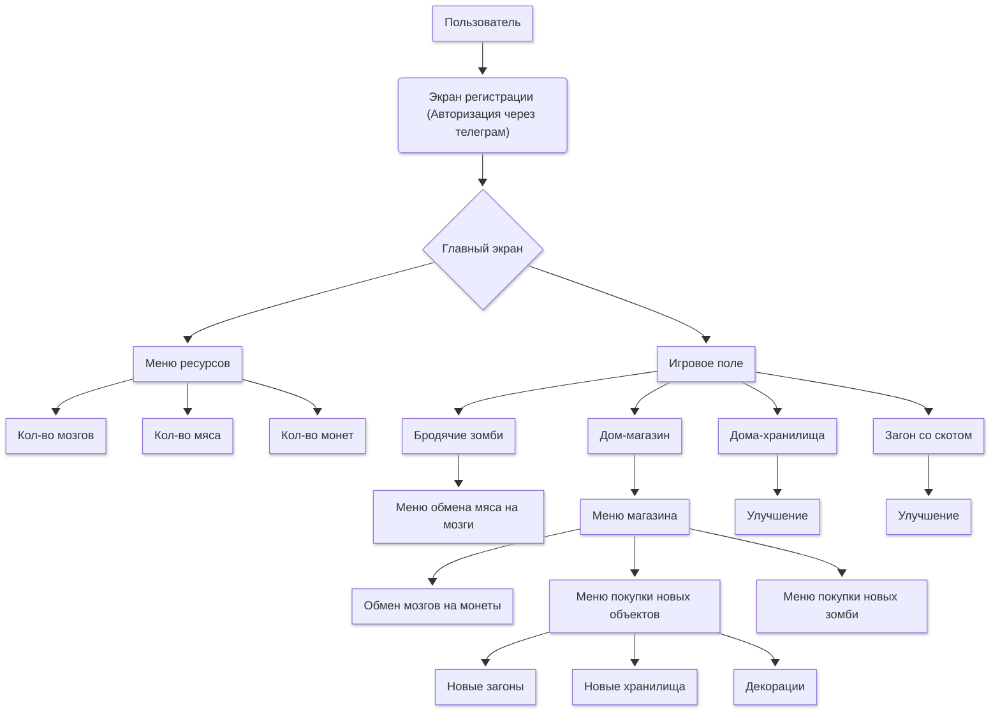

# Zombie-farm DOCS

-----
## Наполнение
* [Основная информация](common/index.md)
* [backend](backend/index.md)
* [frontend](frontend/index.md)
* [design](design/index.md)

## Бизнес - анализ

### Назначение и цели создания системы
"Zombie Farm" представляет собой веб-игру, целью которой является создание своей уникальной фермой, достигается индивидуальность посредством разведения скота и зомби, а также покупкой зданий, позволяющих расширить и ускорить добычу ресурсов и внутриигровой валюты.
### Анализ пользователей
Веб-игра "Zombie Farm" доступна широкому кругу пользователей, в том числе и людям, не имеющим опыта взаимодействия с интерактивными ресурсами, такими как игры, за счет простой интеграции  в иммерсивную среду. Интерфейс аналогичен похожим играм-фермам, что ускорит освоение опытных пользователей. Целевой же аудиторией является молодые люди, от 6 лет до 14 лет, привлечению данной аудитории способствует простая интеграция и стилистика детского рисунка. Проект "Zombie Farm" также может стать хорошей точкой входа для взаимодействия с онлайн играми за счёт простой навигации, аналогичной похожим проектам.

## Диаграмма взаимодействия

